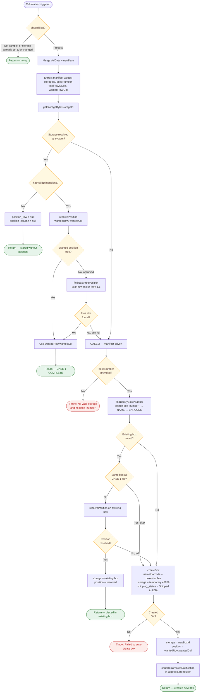
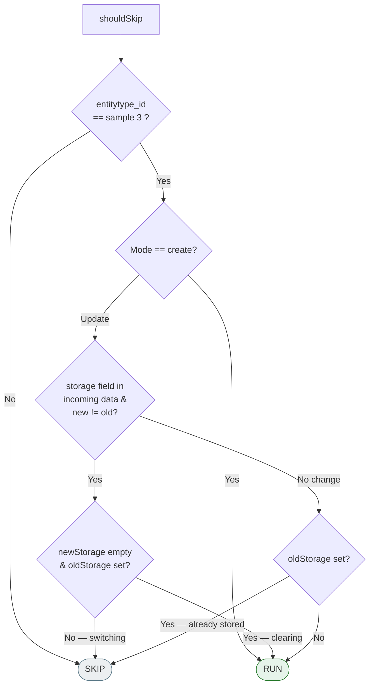
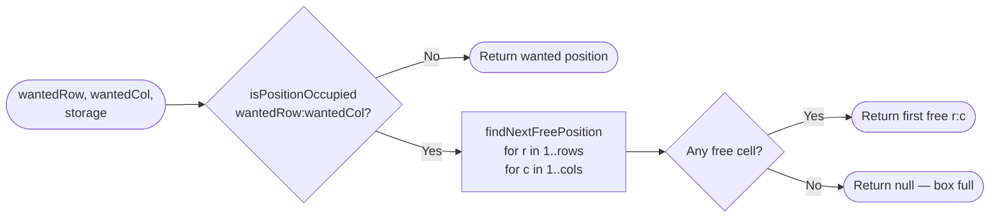

# AutoAssignPosition — Workflow Graph

Workflow representation of [AutoAssignPosition.php](AutoAssignPosition.php) (Johns Hopkins auto-box creation).

## High-level flow

## shouldSkip decision matrix

## resolvePosition sub-flow

## State changes on `$this->data`

| Outcome | `STORAGE` | `POSITION_ROW` | `POSITION_COLUMN` |
|---|---|---|---|
| CASE 1 — no grid | unchanged | `null` | `null` |
| CASE 1 — placed | unchanged | resolved row | resolved column |
| CASE 2 — existing box | existing box id | resolved row | resolved column |
| CASE 2 — new box | new box id | wantedRow | wantedCol |
| Skipped | unchanged | unchanged | unchanged |

## Key constants

- Sample entitytype: **3** — Box entitytype: **7**
- Default box: **9×9**
- Temporary storage id: **45859**
- Shipping status "Shipped to USA": **24**
- Notification operation id: **20**
