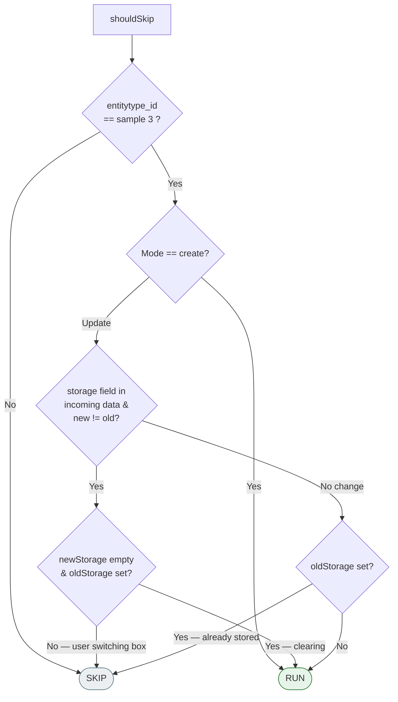
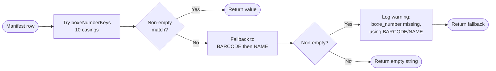
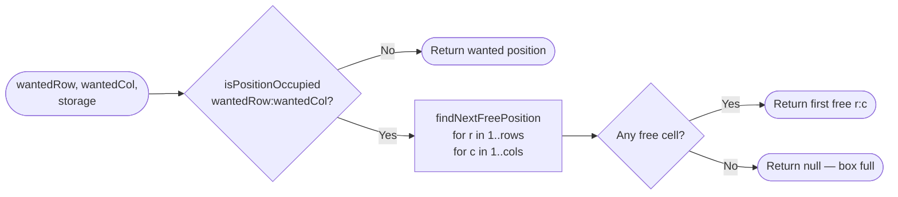
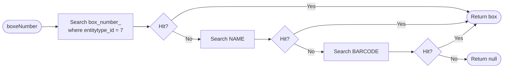
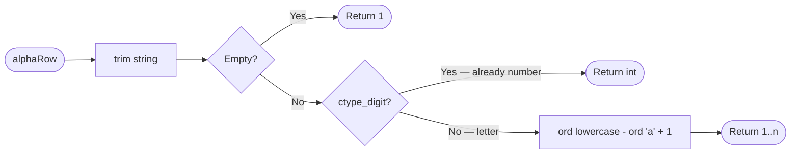

# AutoAssignPositionV2 — Workflow Graph

Workflow representation of [AutoAssignPositionV2.php](AutoAssignPositionV2.php) (Johns Hopkins auto-box creation, v2).

V2 differs from [V1](../AutoAssignPosition.php) by:
- Trying multiple casings/spellings for the manifest `boxe_number` column
- Logging the actual incoming keys before throwing
- Using `throwValidationException` instead of raw `\Exception`
- Falling back to manifest `BARCODE` / `NAME` when no dedicated column exists

## High-level flow

```mermaid
flowchart TD
    Start([Calculation triggered]) --> Skip{shouldSkip?}
    Skip -->|Not sample, or storage already set & unchanged, or user switching storage| End_Skip([Return — no-op])
    Skip -->|Process| Merge[Merge oldData + newData<br/>create mode: just newData]

    Merge --> Extract[Extract manifest values:<br/>storageId, boxeNumber via firstNonEmpty,<br/>totalRows/Cols, wantedRow/Col]
    Extract --> BoxeFallback{boxeNumber<br/>empty?}
    BoxeFallback -->|Yes| FallbackBN[Fallback to manifest<br/>BARCODE / NAME<br/>+ log warning]
    BoxeFallback -->|No| Resolve
    FallbackBN --> Resolve[getStorageById storageId]

    Resolve --> Case1{Storage resolved<br/>by system?}

    %% ── CASE 1 ─────────────────────────────────────────
    Case1 -->|Yes| HasDim{hasValidDimensions?}
    HasDim -->|No| ClearPos[position_row = null<br/>position_column = null]
    ClearPos --> End_C1NoDim([Return — stored without position])

    HasDim -->|Yes| ResolvePos1[resolvePosition<br/>wantedRow, wantedCol]
    ResolvePos1 --> WantedFree1{Wanted position<br/>free?}
    WantedFree1 -->|Yes| Place1[Use wantedRow:wantedCol]
    WantedFree1 -->|No, occupied| Scan1[findNextFreePosition<br/>scan row-major from 1,1]
    Scan1 --> FoundFree1{Free slot<br/>found?}
    FoundFree1 -->|Yes| Place1
    Place1 --> End_C1([Return — CASE 1 COMPLETE])
    FoundFree1 -->|No, box full| Case2

    %% ── CASE 2 ─────────────────────────────────────────
    Case1 -->|No| Case2[CASE 2 — manifest-driven]
    Case2 --> HasBoxeNum{boxeNumber<br/>present?}
    HasBoxeNum -->|No| LogKeys[Log available_keys<br/>+ tried_keys]
    LogKeys --> Throw1([throwValidationException:<br/>No valid storage and<br/>no boxe_number in manifest])

    HasBoxeNum -->|Yes| FindBox[findBoxByBoxeNumber<br/>box_number_ → NAME → BARCODE]
    FindBox --> BoxExists{Existing box<br/>found?}

    BoxExists -->|Yes| SameBox{Same box as<br/>CASE 1 fail?}
    SameBox -->|Yes, skip| CreateNew
    SameBox -->|No| ResolvePos2[resolvePosition on existing box]
    ResolvePos2 --> Found2{Position<br/>resolved?}
    Found2 -->|Yes| SetExisting[storage = existing box<br/>position = resolved]
    SetExisting --> End_C2Existing([Return — placed in existing box])
    Found2 -->|No, full| CreateNew

    BoxExists -->|No| CreateNew[createBox<br/>name/barcode = boxeNumber<br/>storage = temporary 45859<br/>shipping_status = Shipped to USA 24]
    CreateNew --> Created{Created<br/>OK?}
    Created -->|No| Throw2([throwValidationException:<br/>Failed to auto-create box])
    Created -->|Yes| SetNew[storage = newBoxId<br/>position = wantedRow:wantedCol]
    SetNew --> Notify[sendBoxCreatedNotification<br/>in-app to current user]
    Notify --> End_C2New([Return — created new box])

    %% Styling
    classDef terminal fill:#e6f4ea,stroke:#2e7d32,color:#1b5e20
    classDef error fill:#fdecea,stroke:#c62828,color:#b71c1c
    classDef decision fill:#fff8e1,stroke:#f9a825,color:#5d4037
    class End_Skip,End_C1,End_C1NoDim,End_C2Existing,End_C2New terminal
    class Throw1,Throw2 error
    class Skip,Case1,HasDim,WantedFree1,FoundFree1,HasBoxeNum,BoxExists,SameBox,Found2,Created,BoxeFallback decision
```

## shouldSkip decision matrix

## firstNonEmpty + boxeNumber resolution

### Candidate keys tried (in order)

`box_source_number`, `Box_Source_Number`, `BOX_SOURCE_NUMBER`, `box_source_Number`, `boxe_number`, `Boxe_Number`, `BOXE_NUMBER`, `box_number`, `Box_Number`, `BOX_NUMBER`

## resolvePosition sub-flow

## findBoxByBoxeNumber sub-flow

## manifestRowToInt

## State changes on `$this->data`

V2 keeps the **minimal-touch** rule: only `STORAGE`, `POSITION_ROW`, `POSITION_COLUMN` are written.

| Outcome | `STORAGE` | `POSITION_ROW` | `POSITION_COLUMN` |
|---|---|---|---|
| CASE 1 — no grid | unchanged | `null` | `null` |
| CASE 1 — placed | unchanged | resolved row | resolved column |
| CASE 2 — existing box | existing box id | resolved row | resolved column |
| CASE 2 — new box | new box id | wantedRow | wantedCol |
| Skipped | unchanged | unchanged | unchanged |

## Error / throw points

| Trigger | Type | Message |
|---|---|---|
| No valid storage AND no boxe_number anywhere | `throwValidationException` | "No valid storage and no boxe_number in manifest. ..." + logs `available_keys` |
| `createBox` returned null | `throwValidationException` | "Failed to auto-create box '{boxeNumber}'." |
| Notification operation missing or fails | swallowed | logged as `\Log::error`, does not abort save |

## Key constants

- Sample entitytype: **3** — Box entitytype: **7**
- Default box: **9 × 9**
- Temporary storage id: **45859**
- Shipping status "Shipped to USA": **24**
- Notification operation id: **20**

## What V2 adds over V1

| Concern | V1 | V2 |
|---|---|---|
| Manifest column name | Hard-coded `box_source_number` | 10-casing fallback list + `BARCODE`/`NAME` last resort |
| Missing column failure | `throw new \Exception` (opaque) | `throwValidationException` (clean user message) |
| Debug visibility | Generic error | Logs `tried_keys` + `available_keys` before throwing |
| Numeric manifest rows | Always treated as alpha | `ctype_digit` check first, numeric passes through |
